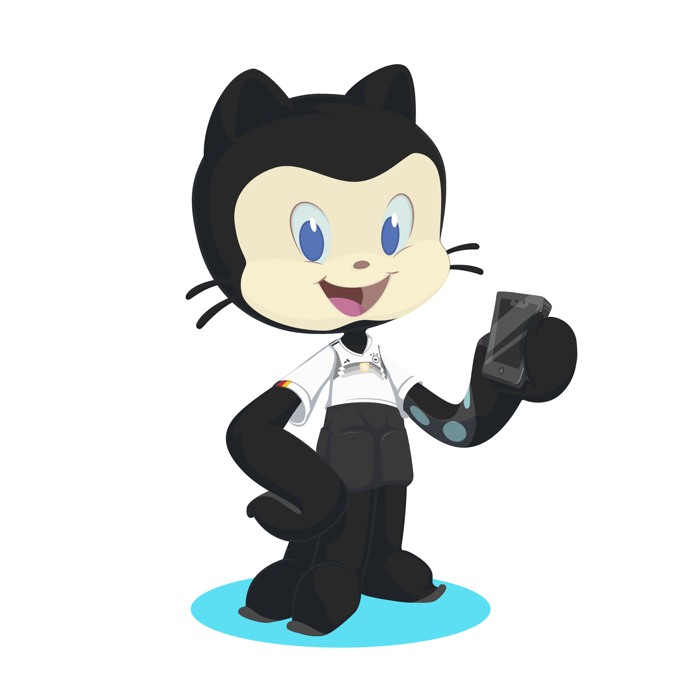

````
 _    _      _                          _ 
| |  | |    | |                        | |
| |  | | ___| | ___ ___  _ __ ___   ___| |
| |/\| |/ _ \ |/ __/ _ \| '_ ` _ \ / _ \ |
\  /\  /  __/ | (_| (_) | | | | | |  __/_|
 \/  \/ \___|_|\___\___/|_| |_| |_|\___(_)                                      
````

Member of the @github Client Apps Platform team focusing on: GraphQL, Ruby, and Go.




